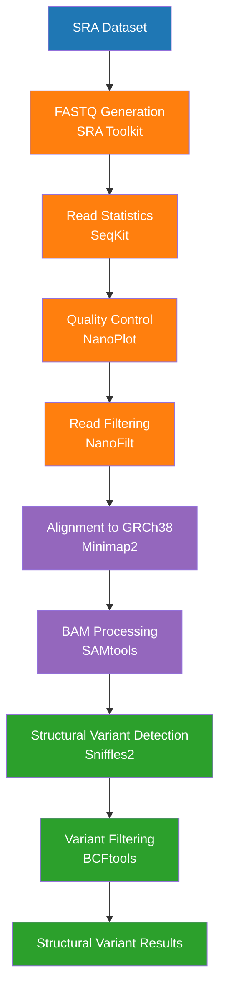

# Nanopore Long-Read Structural Variant Pipeline


A bioinformatics workflow for detecting **structural variants (SVs)** from **Oxford Nanopore long-read sequencing data**.

This pipeline automates processing from **raw sequencing data → structural variant discovery → filtered results**.

Dataset used: **SRR15058164 (PRJNA744329)**

---

# Overview

Long-read sequencing technologies such as **Oxford Nanopore** allow accurate detection of **large structural variants** that are difficult to identify with short-read sequencing.

This pipeline performs:

* Data download from NCBI SRA
* FASTQ generation
* Read statistics and quality control
* Read filtering
* Alignment to the human reference genome
* Structural variant detection
* Variant filtering and summary generation

---

# Pipeline Workflow


---

# Tools Used

| Tool        | Purpose                      |
| ----------- | ---------------------------- |
| SRA Toolkit | Download sequencing data     |
| SeqKit      | FASTQ statistics             |
| NanoPlot    | Read quality analysis        |
| NanoFilt    | Filtering low-quality reads  |
| Minimap2    | Long-read alignment          |
| SAMtools    | BAM processing               |
| Sniffles2   | Structural variant detection |
| BCFtools    | Variant filtering            |

---

# Repository Structure

```
nanopore-longread-sv
│
├── scripts
│   └── nanopore_sv_pipeline.sh
│
├── environment
│   └── environment.yml
│
├── data
│
├── results
│
└── README.md
```

---

# Installation

Clone the repository:

```
git clone https://github.com/Ag-2408/nanopore-longread-sv.git
cd nanopore-longread-sv
```

Create the conda environment:

```
conda env create -f environment/environment.yml
conda activate nanopore_sv_pipeline
```

---

# Running the Pipeline

Execute the pipeline script:

```
bash scripts/nanopore_sv_pipeline.sh
```

---

# Output

The pipeline generates:

* FASTQ statistics
* Quality control reports
* Alignment statistics
* Structural variant VCF files
* Filtered structural variants
* Variant summary reports

All results are stored in the **results/** directory.

---

# Author

**Agrima Mateyal**
MSc Bioinformatics
